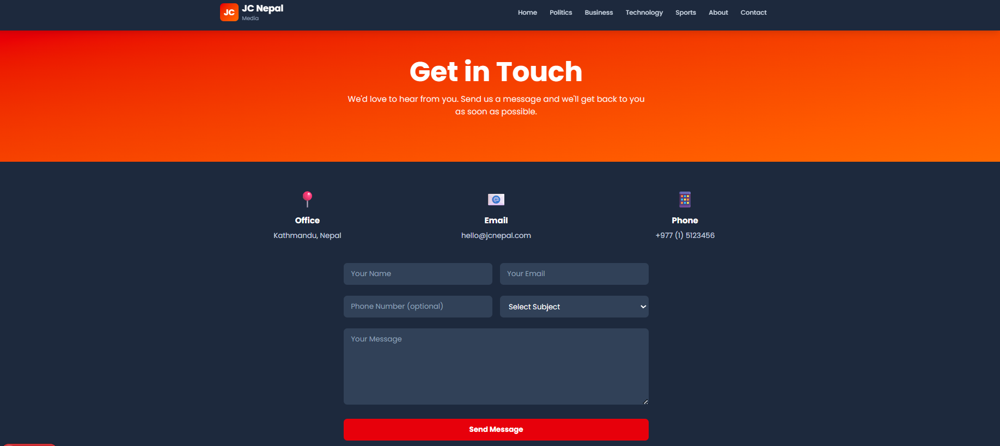

# JC Nepal Media - Modern Online Newspaper

An amazing, modern online newspaper website built with cutting-edge technologies. This platform delivers breaking news, in-depth articles, and engaging stories with stunning design and smooth animations.

## ✨ Features

### 🎯 Core Features
- **Breaking News & Hero Section** - Eye-catching featured article with full-screen hero image
- **Trending Articles** - Real-time trending section showing most-viewed articles
- **Category Management** - Browse articles by Politics, Business, Technology, Sports, Entertainment, and Health
- **Article Details** - Full-featured article pages with author info, reading time, and social sharing
- **Author Profiles** - Showcase of expert contributors and journalists
- **Newsletter Signup** - Email subscription with confirmation
- **Responsive Design** - Works perfectly on mobile, tablet, and desktop
- **Dark Mode** - Automatic dark theme support

### 🎨 Amazing Design & Animations
- **Framer Motion Animations** - Smooth, beautiful animations on every element
- **Gradient Colors** - Modern gradient backgrounds for visual appeal
- **Hover Effects** - Interactive hover states for cards and buttons
- **Scroll Animations** - Elements animate as they come into view
- **Smooth Transitions** - Professional color and scale transitions
- **Custom Scrollbar** - Styled scrollbar with red accent color
- **Mobile-First Design** - Optimized touch interactions for mobile devices

### 📱 Pages Included
- **Home Page** - Hero section, trending, categories, featured, and latest articles
- **Article Details** - Full article content with metadata, likes, and related articles
- **Category Pages** - Filter articles by category with gradient-colored headers
- **About Page** - Company mission, vision, team showcase, and core values
- **Contact Page** - Contact form, office information, and social links

### 🔧 Technical Stack
- **Next.js 16** - Modern React framework with App Router
- **TypeScript** - Type-safe JavaScript for better development
- **Tailwind CSS** - Utility-first CSS framework for styling
- **Framer Motion** - Powerful animation library
- **Next/Image** - Optimized image component
- **Responsive Grid System** - Mobile-first layout approach

## 🚀 Getting Started

### Prerequisites
- Node.js 18+ and npm

### Installation

1. **Install Dependencies**
```bash
npm install
```

2. **Run Development Server**
```bash
npm run dev
```

3. **Open in Browser**
Navigate to [http://localhost:3000](http://localhost:3000)

### Build for Production
```bash
npm run build
npm start
```

## 📂 Project Structure

```
src/
├── app/
│   ├── layout.tsx              # Root layout with Header and Footer
│   ├── page.tsx                # Home page
│   ├── globals.css             # Global styles
│   ├── article/
│   │   └── [slug]/page.tsx     # Article detail page
│   ├── category/
│   │   └── [slug]/page.tsx     # Category page
│   ├── about/
│   │   └── page.tsx            # About page
│   └── contact/
│       └── page.tsx            # Contact page
├── components/
│   ├── Header.tsx              # Navigation header
│   ├── Footer.tsx              # Footer with links
│   ├── HeroSection.tsx         # Full-screen hero banner
│   ├── ArticleCard.tsx         # Article card component
│   ├── TrendingArticles.tsx    # Trending section
│   ├── Categories.tsx          # Category showcase
│   └── NewsletterSignup.tsx    # Email subscription
├── types/
│   └── index.ts                # TypeScript type definitions
└── lib/
    └── mockData.ts             # Sample articles and data
```

## 🎯 Key Components

### Header Component
- Sticky navigation with logo
- Menu items for all major sections
- Mobile hamburger menu
- Smooth animations on scroll

### Article Card
- Responsive image with hover zoom
- Category badge
- Article title and excerpt
- Author information
- Read time indicator

### Hero Section
- Full-screen featured image
- Gradient overlay
- Article preview text
- Call-to-action button
- Animated scroll indicator

### Trending Section
- Top 3 most-viewed articles
- Ranking badges
- View count display
- Animated progress bars

## 📊 Mock Data

The application includes sample data for:
- **6 Articles** - Various categories and topics
- **4 Authors** - With profiles and bio information
- **6 Categories** - With distinct colors and descriptions

## 🎨 Customization

### Colors
Edit the Tailwind classes in components to change:
- Primary colors: Change `red-600`, `orange-500` to your brand colors
- Background colors: Modify `dark:bg-slate-*` classes
- Gradient colors: Update gradient-to-br classes

### Content
Replace mock data in `src/lib/mockData.ts` with:
- Your actual articles and content
- Real author information
- Your company details
- Actual images

### Fonts
The project uses **Poppins** as the primary font (from Google Fonts).

## 📈 Performance

- ⚡ **Fast Load Times** - Optimized images and lazy loading
- 🎯 **SEO Ready** - Metadata and structured data
- 📱 **Mobile Optimized** - Responsive design
- ♿ **Accessible** - Semantic HTML and ARIA labels
- 🎨 **Beautiful Animations** - Hardware-accelerated transforms

## 🔗 Available Routes

- `/` - Home page
- `/article/[slug]` - Article detail page
- `/category/[slug]` - Category articles
- `/about` - About page
- `/contact` - Contact page



---

**Built with ❤️ for JC Nepal Media**

## Learn More

To learn more about Next.js, take a look at the following resources:

- [Next.js Documentation](https://nextjs.org/docs) - learn about Next.js features and API.
- [Learn Next.js](https://nextjs.org/learn) - an interactive Next.js tutorial.

You can check out [the Next.js GitHub repository](https://github.com/vercel/next.js) - your feedback and contributions are welcome!

## Deploy on Vercel

The easiest way to deploy your Next.js app is to use the [Vercel Platform](https://vercel.com/new?utm_medium=default-template&filter=next.js&utm_source=create-next-app&utm_campaign=create-next-app-readme) from the creators of Next.js.

Check out our [Next.js deployment documentation](https://nextjs.org/docs/app/building-your-application/deploying) for more details.
